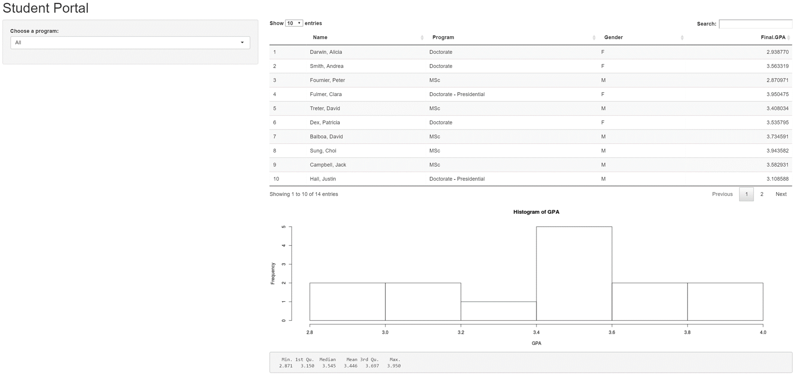
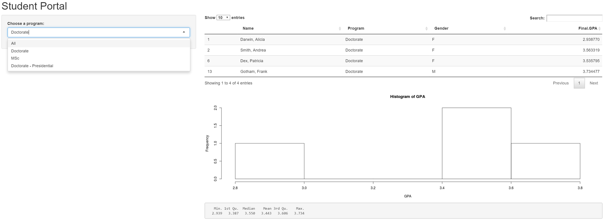

# Student Portal
### Coursera - Developping Data Products Project

Created by Olivia Pinon Fischer

--- 

## Description

This app is for searching, visualizing and sorting through student records. 
The dataset is notional and includes last and first names of the students, the programs they're in (Doctorate, Doctorate Presidential, MSc), and their GPA. 
The app provides the user with the capability to visualize students based on the program the students are enrolled in. After the user decided on which program to visualize, the app updates the table, histogram of GPAs and summary table, accordingly.


---

## The App

[Here](https://oliviapinonfischer.shinyapps.io/myApp/) is the app.



---

## User Interaction

In this very simple dashboard, the user interact with the data through a dropdown menu listing the different programs the students are enrolled in.
He's provided with three options
  - _1. Doctorate_
  - _2. MSc_
  - _3. Doctorate Presidential_ 

```{r block1, eval=F, echo=T} 
sidebarPanel(
    selectInput("Program", "Choose a program:", 
                choices = c("All", unique(as.character(studentData$Program))))
  )
```

---
## Application

The table, histogram and summary table update based on the user input



---
## Details

The code for the back-end of the table, histogram and summary table is provided below:

```{r block2, eval=F, echo=T}
output$table <- DT::renderDataTable(DT::datatable(
    {
      data <- studentData
      if (input$Program != "All")
      {
        data <- studentData[studentData$Program == input$Program,]
      }
      data
    }
  ))
  
  output$plot <- renderPlot({
    data <- studentData
    if (input$Program != "All")
    {
      data <- studentData[studentData$Program == input$Program,]
    }
    data
    GPA <- data$Final.GPA
    hist(GPA)
    })
  
  output$summary <- renderPrint({
    data <- studentData
    if (input$Program != "All")
    {
      data <- studentData[studentData$Program == input$Program,]
    }
    data
    summary(data$Final.GPA)
  })

```

publish(title = 'StudentPortal2', 'index.html', host = 'rpubs')
